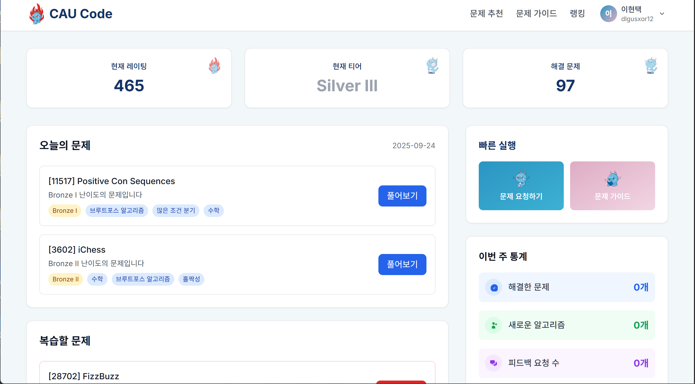

# CAU Code

<div align="center">

**AI 기반 알고리즘 문제 풀이 플랫폼**

[](https://caucode.vercel.app/)
[](https://cau-code.onrender.com/docs)
[](LICENSE)

[한국어](#한국어) | [English](#english)

</div>

---

## 한국어

### 📖 프로젝트 소개

**CAU Code**는 solved.ac API와 OpenAI GPT-4o를 통합한 AI 기반 알고리즘 문제 풀이 플랫폼입니다. 사용자의 실력과 학습 패턴을 분석하여 맞춤형 문제를 추천하고, 제출한 코드에 대한 상세한 AI 피드백을 제공합니다.



### ✨ 주요 기능

#### 🔐 완전한 인증 시스템
- **Google OAuth 2.0** 기반 소셜 로그인
- **solved.ac 프로필 연동** - 실시간 프로필 인증 시스템
- **JWT 토큰** 기반 세션 관리 (Access/Refresh Token)
- **게스트 모드** - 로그인 없이 일부 기능 체험 가능

#### 📊 개인화된 대시보드
- **실시간 통계** - solved.ac 티어, 레이팅, 해결 문제 수
- **주간 통계** - 이번 주 해결 문제, 새로 학습한 알고리즘, 일관성 점수
- **6개월 기여도 그래프** - GitHub처럼 시각화된 활동 내역
- **오늘의 문제** - 날짜별로 고정된 추천 문제 (매일 자정 갱신)
- **복습 문제** - 과거에 틀렸던 문제 재추천
- **최근 활동** - CAU Code 내 문제 해결 및 피드백 요청 로그

#### 🎯 AI 기반 문제 추천
- **적응형 추천** - 현재 실력에 맞는 문제
- **유사 문제** - 최근 해결한 문제와 비슷한 유형
- **도전 문제** - 한 단계 높은 난이도
- **고급 필터링** - 티어, 알고리즘 태그, 해결 상태 등
- **실시간 검색** - solved.ac 통합 문제 검색

#### 💻 인터랙티브 코딩 가이드
- **실제 문제 데이터** - solved.ac에서 실시간으로 불러온 문제 정보
- **다국어 지원** - Python, C++, Java, JavaScript 등
- **코드 에디터** - 문법 강조 및 자동 들여쓰기
- **제출 및 검증** - solved.ac 연동을 통한 정답 확인

#### 🤖 GPT-4o 기반 AI 코드 분석
- **100점 만점 채점** - 정확성, 효율성, 가독성 종합 평가
- **상세한 피드백**
  - ✅ 강점 분석
  - 📈 개선점 제안
  - ⏱️ 시간복잡도 및 공간복잡도 분석
  - 🔍 알고리즘 유형 및 핵심 개념 설명
- **최적화 제안** - 더 나은 알고리즘 및 코드 구조 추천

#### 🏆 실시간 랭킹 시스템
- **전체 랭킹** - CAU Code 등록 사용자 중 상위권
- **소속별 랭킹** - 대학/기관별 순위
- **solved.ac 티어 색상** - 티어에 따른 시각적 구분

### 🛠 기술 스택

#### Frontend


#### Backend


#### DevOps


### 🏗 아키텍처

```
┌─────────────────────────────────────────────────────────────┐
│                         Frontend                            │
│  React 19 + Vite + TailwindCSS + React Router              │
│  (https://caucode.vercel.app)                               │
└──────────────────────┬──────────────────────────────────────┘
                       │ REST API (Axios)
                       │
┌──────────────────────▼──────────────────────────────────────┐
│                         Backend                             │
│  FastAPI + Python 3.11 + PostgreSQL                        │
│  (https://cau-code.onrender.com)                            │
│                                                             │
│  ┌─────────────┐  ┌──────────────┐  ┌──────────────┐      │
│  │   API       │  │   Services   │  │   Clients    │      │
│  │  Endpoints  │──│  (Business   │──│  (External   │      │
│  │             │  │   Logic)     │  │   APIs)      │      │
│  └─────────────┘  └──────────────┘  └──────────────┘      │
│         │                 │                  │              │
│         └────────┬────────┴─────────┬────────┘              │
│                  │                  │                       │
│         ┌────────▼────────┐ ┌──────▼──────────┐            │
│         │   PostgreSQL    │ │  solved.ac API  │            │
│         │   Database      │ │  OpenAI GPT-4o  │            │
│         └─────────────────┘ └─────────────────┘            │
└─────────────────────────────────────────────────────────────┘
```

#### 데이터 흐름

1. **인증 플로우**
   ```
   Google OAuth → Backend 검증 → JWT 발급 → solved.ac 프로필 연동 → 로그인 완료
   ```

2. **문제 추천 플로우**
   ```
   사용자 프로필 분석 → GPT-4o 추천 요청 → solved.ac 문제 검색 → 맞춤형 추천 제공
   ```

3. **AI 피드백 플로우**
   ```
   코드 제출 → DB 저장 → GPT-4o 분석 → 상세 피드백 생성 → 사용자에게 제공
   ```

### 📁 프로젝트 구조

```
CAU Code/
├── frontend/                    # React 프론트엔드
│   ├── src/
│   │   ├── components/         # 재사용 가능한 컴포넌트
│   │   │   ├── dashboard/      # 대시보드 관련 (7개)
│   │   │   ├── guide/          # 코딩 가이드 관련 (5개)
│   │   │   ├── problems/       # 문제 추천 관련 (3개)
│   │   │   ├── Navigation.jsx  # 네비게이션 바
│   │   │   ├── Footer.jsx      # 푸터
│   │   │   └── ProtectedRoute.jsx  # 인증/인가 HOC
│   │   ├── pages/              # 페이지 컴포넌트
│   │   │   ├── Dashboard.jsx   # 대시보드
│   │   │   ├── Problems.jsx    # 문제 추천
│   │   │   ├── Guide.jsx       # 코딩 가이드
│   │   │   ├── Feedback.jsx    # AI 피드백
│   │   │   ├── Ranking.jsx     # 랭킹
│   │   │   ├── Login.jsx       # 로그인
│   │   │   ├── SolvedacAuth.jsx  # solved.ac 인증 요청
│   │   │   ├── VerifyAuth.jsx    # 실시간 인증 확인
│   │   │   └── Profile.jsx     # 프로필
│   │   ├── services/           # API 통신 계층
│   │   │   ├── api.js          # axios 인스턴스
│   │   │   ├── authService.js
│   │   │   ├── userService.js
│   │   │   ├── problemService.js
│   │   │   ├── guideService.js
│   │   │   └── analysisService.js
│   │   ├── contexts/           # React Context
│   │   │   └── AuthContext.jsx # 전역 인증 상태
│   │   └── App.jsx             # 메인 앱 (라우팅)
│   ├── Dockerfile
│   ├── package.json
│   └── vite.config.js
│
├── backend/                     # FastAPI 백엔드
│   ├── app/
│   │   ├── api/v1/
│   │   │   └── endpoints/      # API 엔드포인트
│   │   │       ├── auth.py     # 인증 관련
│   │   │       ├── users.py    # 대시보드/사용자
│   │   │       ├── problems.py # 문제 추천
│   │   │       ├── guide.py    # 코딩 가이드
│   │   │       ├── analysis.py # AI 피드백
│   │   │       └── ranking.py  # 랭킹
│   │   ├── models/             # SQLAlchemy ORM 모델
│   │   │   ├── auth.py         # User, UserSession, ProfileVerification
│   │   │   └── ...
│   │   ├── schemas/            # Pydantic 요청/응답 모델
│   │   ├── services/           # 비즈니스 로직
│   │   │   ├── auth_service.py
│   │   │   ├── solvedac_service.py
│   │   │   ├── problem_service.py
│   │   │   ├── analysis_service.py
│   │   │   └── gpt_service.py
│   │   ├── clients/            # 외부 API 클라이언트
│   │   │   ├── solvedac_client.py
│   │   │   ├── openai_client.py
│   │   │   └── google_oauth_client.py
│   │   ├── utils/              # 유틸리티
│   │   │   ├── cache.py
│   │   │   ├── helpers.py
│   │   │   └── logging.py
│   │   ├── config.py           # 환경 설정
│   │   └── database.py         # DB 연결
│   ├── main.py                 # FastAPI 진입점
│   ├── requirements.txt
│   └── Dockerfile
│
├── database/                    # PostgreSQL 초기화
│   ├── schemas/
│   │   └── schema.sql          # 메인 스키마
│   ├── migrations/             # 마이그레이션 스크립트
│   ├── init.sql                # 초기화 스크립트
│   └── Dockerfile
│
├── docker-compose.yml          # Docker 오케스트레이션
├── .env                        # 환경 변수 (gitignore)
├── .env_example                # 환경 변수 템플릿
├── CLAUDE.md                   # Claude Code 프로젝트 가이드
├── LICENSE                     # Apache 2.0 라이선스
└── README.md                   # 이 파일
```

### 🗄 데이터베이스 스키마

#### 인증 테이블 (Phase 1-3 완료)

**users** - 사용자 기본 정보
- Google OAuth 정보 (google_id, email, name, profile_image_url)
- solved.ac 연동 (solvedac_username, profile_verified)
- 프로필 캐시 (tier, rating, solved_count, class)
- 인증 정보 (verification_attempts, last_verification_attempt)

**user_sessions** - JWT 세션 관리
- Access/Refresh 토큰 해시
- 세션 만료 및 갱신 관리

**profile_verification** - solved.ac 프로필 인증
- 인증 코드 생성 및 관리
- 실시간 인증 상태 추적

#### 애플리케이션 테이블

**user_activities** - 사용자 활동 로그
- 문제 해결 기록
- 피드백 요청 기록

**daily_problems** - 날짜별 고정 문제
- 오늘의 문제 (매일 자정 갱신)
- 복습 문제

**problem_cache** - solved.ac 문제 캐시
- API 호출 최적화

**user_weekly_stats** - 주간 통계 캐시
- 해결 문제 수, 새 알고리즘, 일관성 점수

### 🚀 시작하기

#### 사전 요구사항

- [Docker](https://www.docker.com/get-started) (권장)
- Node.js 20+ (로컬 실행 시)
- Python 3.11+ (로컬 실행 시)
- PostgreSQL 15+ (로컬 실행 시)

#### 환경 변수 설정

1. `.env_example` 파일을 `.env`로 복사
2. 필요한 API 키 입력:

```bash
# OpenAI API Key (필수)
OPEN_AI_KEY=your_openai_api_key_here

# Google OAuth (필수)
VITE_GOOGLE_CLIENT_ID=your_google_oauth_client_id_here
GOOGLE_CLIENT_ID=your_google_oauth_client_id_here
GOOGLE_CLIENT_SECRET=your_google_oauth_client_secret_here

# JWT Secret (프로덕션에서 반드시 변경)
JWT_SECRET_KEY=your_jwt_secret_key_here_change_in_production

# Database (Docker 사용 시 기본값 유지)
DB_NAME=caucode
DB_USER=caucode_user
DB_PASSWORD=dev_password_123
DB_HOST=cau-code-db
DB_PORT=5432

# Frontend API URL
VITE_API_BASE_URL=http://localhost:8000/api/v1
```

#### Docker로 실행 (권장)

```bash
# 1. 레포지토리 클론
git clone https://github.com/your-username/cau-code.git
cd cau-code

# 2. 환경 변수 설정
cp .env_example .env
# .env 파일을 편집하여 API 키 입력

# 3. Docker Compose로 전체 서비스 실행
docker-compose up

# 백그라운드 실행
docker-compose up -d

# 로그 확인
docker-compose logs -f
```

서비스 접속:
- **Frontend**: http://localhost:5173
- **Backend API**: http://localhost:8000
- **API 문서 (Swagger)**: http://localhost:8000/docs
- **Database**: localhost:5432

#### 개별 실행 (로컬 개발)

**Frontend**
```bash
cd frontend
npm install
npm run dev
```

**Backend**
```bash
cd backend
pip install -r requirements.txt
uvicorn main:app --reload --host 0.0.0.0 --port 8000
```

**Database**
```bash
# PostgreSQL 15 설치 후
psql -U postgres
CREATE DATABASE caucode;
CREATE USER caucode_user WITH PASSWORD 'dev_password_123';
GRANT ALL PRIVILEGES ON DATABASE caucode TO caucode_user;

# 스키마 적용
psql -U caucode_user -d caucode -f database/init.sql
psql -U caucode_user -d caucode -f database/schemas/schema.sql
```

### 📡 API 엔드포인트

전체 API 문서는 [Swagger UI](https://cau-code.onrender.com/docs)에서 확인하세요.

#### Authentication (`/api/v1/auth`)
- `POST /google-login` - Google OAuth 로그인
- `POST /logout` - 로그아웃
- `GET /me` - 현재 사용자 정보
- `POST /refresh-token` - JWT 토큰 갱신
- `POST /solvedac-verify` - solved.ac 프로필 인증 요청
- `GET /check-verification` - 실시간 인증 상태 확인

#### Users (`/api/v1/users`)
- `GET /dashboard/{username}` - 대시보드 전체 정보
- `GET /stats/{username}` - solved.ac 통계
- `GET /weekly-stats/{username}` - 주간 통계
- `GET /todays-problems/{username}` - 오늘의 문제
- `GET /contribution/{username}` - 6개월 기여도 그래프
- `GET /activities/{username}` - 활동 로그

#### Problems (`/api/v1/problems`)
- `GET /stats` - 추천 통계
- `GET /recommendations` - AI 기반 문제 추천
- `GET /filter-options` - 필터 옵션
- `GET /search` - 문제 검색

#### Guide (`/api/v1/guide`)
- `GET /problem/{problem_id}` - 문제 상세 정보
- `GET /languages` - 지원 언어 목록
- `POST /submit-for-analysis` - 코드 제출
- `GET /verify-solution` - 정답 검증

#### Analysis (`/api/v1/analysis`)
- `GET /feedback/submission/{submission_id}` - AI 피드백 조회
- `POST /optimize` - 코드 최적화 제안
- `POST /algorithm/explain` - 알고리즘 설명

#### Ranking (`/api/v1/ranking`)
- `GET /global` - 전체 랭킹
- `GET /organization` - 소속별 랭킹

### 🌐 배포

#### 프로덕션 환경

- **Frontend**: [Vercel](https://vercel.com) - https://caucode.vercel.app/
- **Backend**: [Render](https://render.com) - https://cau-code.onrender.com
- **Database**: Render PostgreSQL (오레곤 리전)

#### 배포 가이드

**Frontend (Vercel)**
1. GitHub 레포지토리 연결
2. Build Command: `cd frontend && npm install && npm run build`
3. Output Directory: `frontend/dist`
4. Environment Variables: `.env`의 `VITE_*` 변수 추가

**Backend (Render)**
1. Docker 배포 선택
2. Dockerfile 경로: `backend/Dockerfile`
3. Environment Variables: `.env`의 모든 변수 추가 (DB 제외)

**Database (Render PostgreSQL)**
1. PostgreSQL 15 인스턴스 생성
2. 데이터베이스 초기화:
   ```bash
   psql $DATABASE_URL -f database/init.sql
   psql $DATABASE_URL -f database/schemas/schema.sql
   ```

### 🤝 기여하기

기여는 언제나 환영합니다! 다음 단계를 따라주세요:

1. Fork the Project
2. Create your Feature Branch (`git checkout -b feature/AmazingFeature`)
3. Commit your Changes (`git commit -m 'Add some AmazingFeature'`)
4. Push to the Branch (`git push origin feature/AmazingFeature`)
5. Open a Pull Request

#### 개발 컨벤션

**Frontend (React)**
- 함수형 컴포넌트 + Hooks 패턴
- PascalCase: 컴포넌트 파일명
- camelCase: 함수, 변수명
- Service 계층을 통한 API 통신
- TailwindCSS 유틸리티 클래스 사용

**Backend (FastAPI)**
- 비동기 함수 (async/await) 사용
- Clean Architecture (API → Service → Client/DB)
- Pydantic으로 요청/응답 검증
- 상세한 로깅 및 에러 처리
- Type Hints 필수

**Database**
- 기존 SQL 코드 참고하여 스키마 설계
- 인덱스 최적화 고려
- 마이그레이션 파일로 버전 관리

**기타**
- Docker로 개발 및 테스트
- 임시 해결책 사용 시 TODO 주석 남기기
- PR은 `develop` 브랜치로 제출 → `main` 브랜치로 머지

### 📄 라이선스

이 프로젝트는 Apache License 2.0 라이선스 하에 배포됩니다. 자세한 내용은 [LICENSE](LICENSE) 파일을 참조하세요.

### 📧 문의

프로젝트 관련 문의사항이나 버그 리포트는 [GitHub Issues](https://github.com/your-username/cau-code/issues)에 등록해주세요.

---

## English

### 📖 Project Overview

**CAU Code** is an AI-powered algorithm practice platform that integrates the solved.ac API and OpenAI GPT-4o. It analyzes users' skill levels and learning patterns to recommend personalized problems and provides detailed AI feedback on submitted code.

### ✨ Key Features

#### 🔐 Complete Authentication System
- **Google OAuth 2.0** social login
- **solved.ac Profile Integration** - Real-time profile verification system
- **JWT Token** based session management (Access/Refresh Token)
- **Guest Mode** - Try some features without login

#### 📊 Personalized Dashboard
- **Real-time Statistics** - solved.ac tier, rating, solved count
- **Weekly Statistics** - Problems solved this week, new algorithms learned, consistency score
- **6-Month Contribution Graph** - GitHub-style visualized activity history
- **Today's Problems** - Daily fixed recommended problems (refreshed at midnight)
- **Review Problems** - Re-recommendations of previously failed problems
- **Recent Activities** - Problem solving and feedback request logs in CAU Code

#### 🎯 AI-Powered Problem Recommendations
- **Adaptive Recommendations** - Problems matching current skill level
- **Similar Problems** - Problems similar to recently solved ones
- **Challenge Problems** - One level higher difficulty
- **Advanced Filtering** - By tier, algorithm tags, solve status, etc.
- **Real-time Search** - Problem search integrated with solved.ac

#### 💻 Interactive Coding Guide
- **Real Problem Data** - Problem information loaded in real-time from solved.ac
- **Multi-language Support** - Python, C++, Java, JavaScript, etc.
- **Code Editor** - Syntax highlighting and auto-indentation
- **Submit & Verify** - Answer verification through solved.ac integration

#### 🤖 GPT-4o Based AI Code Analysis
- **100-Point Grading** - Comprehensive evaluation of accuracy, efficiency, readability
- **Detailed Feedback**
  - ✅ Strengths analysis
  - 📈 Improvement suggestions
  - ⏱️ Time and space complexity analysis
  - 🔍 Algorithm type and core concept explanation
- **Optimization Suggestions** - Recommendations for better algorithms and code structure

#### 🏆 Real-time Ranking System
- **Global Ranking** - Top users registered in CAU Code
- **Organization Ranking** - Rankings by university/institution
- **solved.ac Tier Colors** - Visual distinction by tier

### 🛠 Tech Stack

#### Frontend
- React 19.1.1 - UI framework
- Vite 7.1.2 - Build tool
- TailwindCSS 3.4.14 - Styling
- React Router 7.9.1 - SPA routing
- Axios 1.12.2 - HTTP client

#### Backend
- FastAPI 0.104.1 - REST API framework
- Python 3.11 - Programming language
- PostgreSQL 15 - Relational database
- SQLAlchemy 2.0.23 - ORM
- asyncpg 0.29.0 - Async PostgreSQL driver
- OpenAI 1.3.7 - GPT-4o integration
- google-auth 2.23.4 - Google OAuth
- APScheduler 3.10.4 - Background task scheduling

#### DevOps
- Docker - Containerization
- Vercel - Frontend deployment
- Render - Backend & Database deployment

### 🚀 Getting Started

#### Prerequisites

- [Docker](https://www.docker.com/get-started) (Recommended)
- Node.js 20+ (for local execution)
- Python 3.11+ (for local execution)
- PostgreSQL 15+ (for local execution)

#### Environment Setup

1. Copy `.env_example` to `.env`
2. Enter required API keys:

```bash
# OpenAI API Key (Required)
OPEN_AI_KEY=your_openai_api_key_here

# Google OAuth (Required)
VITE_GOOGLE_CLIENT_ID=your_google_oauth_client_id_here
GOOGLE_CLIENT_ID=your_google_oauth_client_id_here
GOOGLE_CLIENT_SECRET=your_google_oauth_client_secret_here

# JWT Secret (Must change in production)
JWT_SECRET_KEY=your_jwt_secret_key_here_change_in_production

# Database (Keep defaults when using Docker)
DB_NAME=caucode
DB_USER=caucode_user
DB_PASSWORD=dev_password_123
DB_HOST=cau-code-db
DB_PORT=5432

# Frontend API URL
VITE_API_BASE_URL=http://localhost:8000/api/v1
```

#### Run with Docker (Recommended)

```bash
# 1. Clone repository
git clone https://github.com/your-username/cau-code.git
cd cau-code

# 2. Setup environment variables
cp .env_example .env
# Edit .env file and enter API keys

# 3. Run all services with Docker Compose
docker-compose up

# Run in background
docker-compose up -d

# View logs
docker-compose logs -f
```

Access services:
- **Frontend**: http://localhost:5173
- **Backend API**: http://localhost:8000
- **API Docs (Swagger)**: http://localhost:8000/docs
- **Database**: localhost:5432

#### Individual Execution (Local Development)

**Frontend**
```bash
cd frontend
npm install
npm run dev
```

**Backend**
```bash
cd backend
pip install -r requirements.txt
uvicorn main:app --reload --host 0.0.0.0 --port 8000
```

**Database**
```bash
# After installing PostgreSQL 15
psql -U postgres
CREATE DATABASE caucode;
CREATE USER caucode_user WITH PASSWORD 'dev_password_123';
GRANT ALL PRIVILEGES ON DATABASE caucode TO caucode_user;

# Apply schema
psql -U caucode_user -d caucode -f database/init.sql
psql -U caucode_user -d caucode -f database/schemas/schema.sql
```

### 📡 API Endpoints

Full API documentation is available at [Swagger UI](https://cau-code.onrender.com/docs).

#### Authentication (`/api/v1/auth`)
- `POST /google-login` - Google OAuth login
- `POST /logout` - Logout
- `GET /me` - Current user info
- `POST /refresh-token` - Refresh JWT token
- `POST /solvedac-verify` - Request solved.ac profile verification
- `GET /check-verification` - Check real-time verification status

#### Users (`/api/v1/users`)
- `GET /dashboard/{username}` - Complete dashboard info
- `GET /stats/{username}` - solved.ac statistics
- `GET /weekly-stats/{username}` - Weekly statistics
- `GET /todays-problems/{username}` - Today's problems
- `GET /contribution/{username}` - 6-month contribution graph
- `GET /activities/{username}` - Activity logs

#### Problems (`/api/v1/problems`)
- `GET /stats` - Recommendation statistics
- `GET /recommendations` - AI-based problem recommendations
- `GET /filter-options` - Filter options
- `GET /search` - Search problems

#### Guide (`/api/v1/guide`)
- `GET /problem/{problem_id}` - Problem details
- `GET /languages` - Supported languages
- `POST /submit-for-analysis` - Submit code
- `GET /verify-solution` - Verify solution

#### Analysis (`/api/v1/analysis`)
- `GET /feedback/submission/{submission_id}` - Get AI feedback
- `POST /optimize` - Code optimization suggestions
- `POST /algorithm/explain` - Algorithm explanation

#### Ranking (`/api/v1/ranking`)
- `GET /global` - Global ranking
- `GET /organization` - Organization ranking

### 🤝 Contributing

Contributions are always welcome! Please follow these steps:

1. Fork the Project
2. Create your Feature Branch (`git checkout -b feature/AmazingFeature`)
3. Commit your Changes (`git commit -m 'Add some AmazingFeature'`)
4. Push to the Branch (`git push origin feature/AmazingFeature`)
5. Open a Pull Request

### 📄 License

This project is licensed under the Apache License 2.0. See the [LICENSE](LICENSE) file for details.

### 📧 Contact

For questions or bug reports, please open an issue on [GitHub Issues](https://github.com/your-username/cau-code/issues).

---

<div align="center">

**Made with ❤️ by CAU Code Team**

</div>
